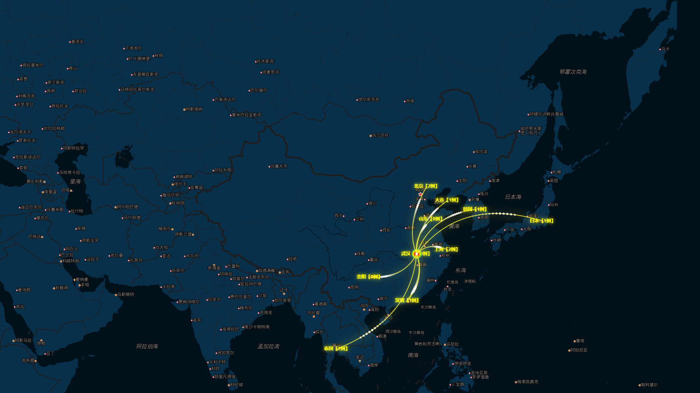

# ncov
Focus on Wuhan 2019-nCoV, data visualization, to help analyze the epidemic situation.  May the world be well. 关注武汉肺炎，数据可视化，以提供帮助分析疫情。 愿世界安好。

> 声明：本库旨在分析有关nCvo官方提供的地点、人数、等医学数据进行分析可视化数据。同时个人也希望能够相关工作提供一丢丢儿分析帮助，如果觉得该仓库帮倒忙，请联系作者删除仓库。并为未来可能引发不好的事件致歉。by @veaba 2020年1月20日10:42:30

 <a href="https://2019-ncov.datav.ai">2019-nCov感染可视化(科学上网)</a>

##  科普

### 什么是冠状病毒？

冠状病毒是自然界广泛存在的一类病毒，因该病毒形态在电镜下观察类似王冠而得名。目前为止发现，冠状病毒仅感染脊椎动物，可引起人和动物呼吸道、消化道和神经系统疾病。

除本次发现的新型冠状病毒(世界卫生组织已将其命名为“`2019-nCoV`，即2019新型冠状病毒”)外，已知感染人的冠状病毒还有6种。其中4种在人群中较为常见，
致病性较低，一般仅引起类似普通感冒的轻微呼吸道症状;另外2种是我们熟知的`SARS`冠状病毒和`MERS`冠状病毒。

但这次发现的新型冠状病毒与SARS冠状病毒和MERS冠状病毒有很大不同。和人一样，不同病毒之间虽然是近亲，
但性情、态度、处事都有很大不同，新型冠状病毒虽然是SARS近亲，但还未表现出SARS那么可怕的特性，
因此，不必为此感到恐慌。

### 2019-nCoV感染患者临床表现有哪些？

#### 一般症状
- 发热、乏力、干咳、
- 逐渐出现呼吸困难
- 部分患者起病症状轻微，可无发热

#### 严重者
- 急性呼吸窘迫综合征
- 脓毒症休克
- 难以纠正的代谢性酸中毒
- 出凝血功能障碍

多数患者为中轻症，预后良好，少数患者病情危重，甚至死亡。

### 什么是密切接触者?

与病例(观察和确诊病例)发病后有如下接触情形之一者:

- 与病例共同居住、学习、工作或其他有密切接触的人员
- 诊疗、护理、探视病例时未采取有效防护措施的医护人员、家属或其他与病例有类似近距离接触的人员
- 病例同病室的其他患者及陪护人员
- 与病例乘坐同一交通工具并有近距离接触人员
- 现场调查人员调查后经评估认为符合条件的人员

### 为什么要对密切接触者医学观察14天？
目前对密切接触者采取较为严格的医学观察等预防性公共卫生措施十分必要，这是一种对公众健康安全负责任的态度，
也是国际社会通行的做法。参考其他冠状病毒所致疾病潜伏期、此次新型冠状病毒病例相关信息和当前防控实际，
将密切接触者医学观察期定为14天，并对密切接触者进行居家医学观察。

### 如果接到疾控部门通知，你是一个密切接触者，该怎么办？
按照要求进行居家医学观察，不用恐慌，不要上班，不要随便外出，做好自我身体状况观察，定
期接受社区医生的随访，如果出现发热、咳嗽等异常临床表现，及时向当地疾病预防控制机构报告，
在其指导下到指定医疗机构进行排查、诊治等。

### 如何预防冬春季呼吸道传染病？
- 目前正处于冬春季传染病高发季节，市民要增强卫生健康意识，加强锻炼，规律作息，提高自身免疫力。
- 注意保持室内空气流通,避免到封闭、空气不流通的公众场合和人多集中地方，必要时可佩戴口罩。
- 外出回家后，及时洗手、洗鼻。如有发热和其他呼吸道感染症状，特别是持续发热不退，及时到医疗机构就诊。

### 怎么样戴口罩？
戴口罩是阻断呼吸道分泌物传播的有效手段。选择医用外科口罩能很好地预防呼吸道疾病。
一次性医用口罩佩戴时，要将折面完全展开，将嘴、鼻、下颌完全包住，然后压紧鼻夹，使口罩与面部完全贴合。

戴口罩前应洗手，或者在戴口罩过程中避免手接触到口罩内侧面，减少口罩被污染的可能。
分清楚口罩的内外、上下，浅色面为内，应该贴着嘴鼻，深色面朝外;金属条(鼻夹)一端是口罩的上方。要定期更换、不可戴反，更不能两面轮流戴。

### 怎么洗手？
在餐前便后、外出回家、接触垃圾、抚摸动物后，要记得洗手。洗手时，要注意用流动
的水和使用肥皂(皂液)洗手，揉搓的时间不少于15秒。
为了方便记忆，揉搓步骤简单归纳为七字口诀:“内——外——夹——弓——大——立——腕”

1. 掌心对掌心，相互揉搓
2. 掌心对手背，两手交叉揉搓
3. 掌心对掌心，十指交叉揉搓
4. 十指弯曲紧扣，转动揉搓
5. 拇指握在掌心，转动揉搓
6. 指尖在掌心揉搓
7. 清洁手腕

以上来自：湖北省卫生计生宣教中心 & 武汉市卫生计生宣教中心 2020年1月

## todo预防、治疗、救助/Support

### 预防和日常防护

[来源:@人民日报 微博](https://weibo.com/2803301701/IqHgkeDcB?ref=home&rid=0_0_8_1413025454238785321_0_0_0)

- 病毒`56℃`，30分钟就死亡了
- `乙醚`、7`5%的乙醇`等都可以有效灭活病毒。

### 武汉市设置发热门诊机构和定点救助医疗机构名单
来源: [武汉市设置发热门诊医疗机构和定点救治医疗机构名单](http://wjw.wuhan.gov.cn/front/web/showDetail/2020012009078)

<table cellpadding="0" cellspacing="0" height="2135" align="center"><colgroup><col width="105" style="width:105px"><col width="352" style="width:352px"><col width="174" style="width:174px"></colgroup><tbody><tr height="33" style="height:33px" class="firstRow"><td height="33" width="97" x:str="" style="border-width: 1px; border-style: solid;" align="center" valign="middle">辖区</td><td width="360" x:str="" style="border-width: 1px; border-style: solid;" align="center" valign="middle">设置发热门诊医疗机构</td><td width="174" x:str="" style="border-width: 1px; border-style: solid;" align="center" valign="middle">定点医疗机构</td></tr><tr height="33" style="height:33px"><td rowspan="8" height="266" width="97" x:str="" style="border-width: 1px; border-style: solid; word-break: break-all;" align="center" valign="middle">江岸区（发热门诊8家）</td><td width="360" x:str="" style="border-width: 1px; border-style: solid;">武汉市中医医院</td><td rowspan="18" width="174" x:str="" style="border-width: 1px; border-style: solid;" align="center" valign="middle">市金银潭医院 市肺科医院 市汉口医院</td></tr><tr height="33" style="height:33px"><td width="344" x:str="" style="border-width: 1px; border-style: solid;">中部战区总医院（汉口院区）</td></tr><tr height="33" style="height:33px"><td width="344" x:str="" style="border-width: 1px; border-style: solid;">长航总医院</td></tr><tr height="33" style="height:33px"><td width="344" x:str="" style="border-width: 1px; border-style: solid;">武汉市第八医院</td></tr><tr height="33" style="height:33px"><td width="344" x:str="" style="border-width: 1px; border-style: solid;">武汉市中心医院</td></tr><tr height="33" style="height:33px"><td width="344" x:str="" style="border-width: 1px; border-style: solid;">武汉市汉口医院</td></tr><tr height="33" style="height:33px"><td width="344" x:str="" style="border-width: 1px; border-style: solid;">武汉儿童医院</td></tr><tr height="33" style="height:33px"><td width="344" x:str="" style="border-width: 1px; border-style: solid;">武汉市第六医院</td></tr><tr height="33" style="height:33px"><td rowspan="5" height="166" width="97" x:str="" style="border-width: 1px; border-style: solid; word-break: break-all;" align="center" valign="middle">江汉区（发热门诊5家）</td><td width="360" x:str="" style="border-width: 1px; border-style: solid;">协和医院</td></tr><tr height="33" style="height:33px"><td width="344" x:str="" style="border-width: 1px; border-style: solid;">湖北省中西医结合医院</td></tr><tr height="33" style="height:33px"><td width="344" x:str="" style="border-width: 1px; border-style: solid;">武汉市中心医院（后湖院区）</td></tr><tr height="33" style="height:33px"><td width="344" x:str="" style="border-width: 1px; border-style: solid;">武汉市红十字会医院</td></tr><tr height="33" style="height:33px"><td width="344" x:str="" style="border-width: 1px; border-style: solid;">武汉亚洲心脏病医院</td></tr><tr height="33" style="height:33px"><td rowspan="5" height="166" width="97" x:str="" style="border-width: 1px; border-style: solid; word-break: break-all;" align="center" valign="middle">硚口区（发热门诊5家）</td><td width="360" x:str="" style="border-width: 1px; border-style: solid;">华中科技大学同济医学院附属同济医院</td></tr><tr height="33" style="height:33px"><td width="344" x:str="" style="border-width: 1px; border-style: solid;">湖北省第三人民医院</td></tr><tr height="33" style="height:33px"><td width="344" x:str="" style="border-width: 1px; border-style: solid;">武汉市第一医院</td></tr><tr height="33" style="height:33px"><td width="344" x:str="" style="border-width: 1px; border-style: solid;">武汉市第四医院</td></tr><tr height="33" style="height:33px"><td width="344" x:str="" style="border-width: 1px; border-style: solid;">武汉市肺科医院</td></tr><tr height="33" style="height:33px"><td rowspan="4" height="133" width="97" x:str="" style="border-width: 1px; border-style: solid; word-break: break-all;" align="center" valign="middle">汉阳区（发热门诊4家）</td><td width="360" x:str="" style="border-width: 1px; border-style: solid;">武汉市第五医院</td><td rowspan="23" width="174" x:str="" style="border-width: 1px; border-style: solid;" align="center" valign="middle">市金银潭医院 市肺科医院 市汉口医院</td></tr><tr height="33" style="height:33px"><td width="344" x:str="" style="border-width: 1px; border-style: solid;">武汉市汉阳医院</td></tr><tr height="33" style="height:33px"><td width="344" x:str="" style="border-width: 1px; border-style: solid;">武汉市中医医院（汉阳院区）</td></tr><tr height="33" style="height:33px"><td width="344" x:str="" style="border-width: 1px; border-style: solid;">武汉龙阳医院</td></tr><tr height="33" style="height:33px"><td rowspan="9" height="299" width="97" x:str="" style="border-width: 1px; border-style: solid; word-break: break-all;" align="center" valign="middle">武昌区（发热门诊9家）</td><td width="360" x:str="" style="border-width: 1px; border-style: solid;">武汉大学人民医院</td></tr><tr height="33" style="height:33px"><td width="344" x:str="" style="border-width: 1px; border-style: solid;">武汉大学中南医院</td></tr><tr height="33" style="height:33px"><td width="344" x:str="" style="border-width: 1px; border-style: solid;">武汉科技大学附属天佑医院</td></tr><tr height="33" style="height:33px"><td width="344" x:str="" style="border-width: 1px; border-style: solid;">湖北省中医院</td></tr><tr height="33" style="height:33px"><td width="344" x:str="" style="border-width: 1px; border-style: solid;">武汉市第三医院</td></tr><tr height="33" style="height:33px"><td width="344" x:str="" style="border-width: 1px; border-style: solid;">武汉市武昌医院</td></tr><tr height="33" style="height:33px"><td width="344" x:str="" style="border-width: 1px; border-style: solid;">武汉市第七医院</td></tr><tr height="33" style="height:33px"><td width="344" x:str="" style="border-width: 1px; border-style: solid;">武警湖北省总队医院</td></tr><tr height="33" style="height:33px"><td width="344" x:str="" style="border-width: 1px; border-style: solid;">解放军中部战区总医院</td></tr><tr height="33" style="height:33px"><td rowspan="6" height="200" width="97" x:str="" style="border-width: 1px; border-style: solid; word-break: break-all;" align="center" valign="middle">青山区（发热门诊6家）</td><td width="360" x:str="" style="border-width: 1px; border-style: solid;">华润武钢总医院</td></tr><tr height="33" style="height:33px"><td width="344" x:str="" style="border-width: 1px; border-style: solid;">武汉市普仁医院</td></tr><tr height="33" style="height:33px"><td width="344" x:str="" style="border-width: 1px; border-style: solid;">武汉市武东医院</td></tr><tr height="33" style="height:33px"><td width="344" x:str="" style="border-width: 1px; border-style: solid;">武钢第二职工医院</td></tr><tr height="33" style="height:33px"><td width="344" x:str="" style="border-width: 1px; border-style: solid;">武汉市第九医院</td></tr><tr height="33" style="height:33px"><td width="344" x:str="" style="border-width: 1px; border-style: solid;">武汉市石化医院</td></tr><tr height="33" style="height:33px"><td rowspan="4" height="133" width="97" x:str="" style="border-width: 1px; border-style: solid; word-break: break-all;" align="center" valign="middle">
洪山区（发热门诊4家）
</td><td width="360" x:str="" style="border-width: 1px; border-style: solid;">武汉市第三医院（光谷院区）</td></tr><tr height="33" style="height:33px"><td width="344" x:str="" style="border-width: 1px; border-style: solid;">湖北省中医院（光谷院区）</td></tr><tr height="33" style="height:33px"><td width="344" x:str="" style="border-width: 1px; border-style: solid;">湖北省妇幼保健院</td></tr><tr height="33" style="height:33px"><td width="344" x:str="" style="border-width: 1px; border-style: solid;">湖北省荣军医院</td></tr><tr height="49" style="height:49px"><td rowspan="2" height="82" width="97" x:str="" style="border-width: 1px; border-style: solid;" align="center" valign="middle">东湖高新区 (发热门诊2家)</td><td width="360" x:str="" style="border-width: 1px; border-style: solid;">华中科技大学同济医学院附属同济医院（光谷院区）</td><td rowspan="3" width="174" x:str="" style="border-width: 1px; border-style: solid;" align="center" valign="middle">市金银潭医院 市肺科医院 市汉口医院</td></tr><tr height="33" style="height:33px"><td width="344" x:str="" style="border-width: 1px; border-style: solid;">武汉大学人民医院（东院）</td></tr><tr height="50" style="height:50px"><td height="50" width="97" x:str="" style="border-width: 1px; border-style: solid;" align="center" valign="middle">东湖风景区 (发热门诊1家)</td><td width="360" x:str="" style="border-width: 1px; border-style: solid;">华中科技大学同济医学院附属梨园医院</td></tr><tr height="33" style="height:33px"><td rowspan="4" height="150" width="97" x:str="" style="border-width: 1px; border-style: solid; word-break: break-all;" align="center" valign="middle">蔡甸区（发热门诊4家）</td><td width="360" x:str="" style="border-width: 1px; border-style: solid;">武汉市蔡甸区人民医院</td><td rowspan="4" x:str="" style="border-width: 1px; border-style: solid;" align="center" valign="middle">蔡甸区人民医院</td></tr><tr height="33" style="height:33px"><td width="344" x:str="" style="border-width: 1px; border-style: solid;">武汉市蔡甸区中医医院</td></tr><tr height="33" style="height:33px"><td width="344" x:str="" style="border-width: 1px; border-style: solid;">武汉济和医院</td></tr><tr height="50" style="height:50px"><td width="344" x:str="" style="border-width: 1px; border-style: solid;">华中科技大学同济医学院附属同济医院（中法新城院区）</td></tr><tr height="33" style="height:33px"><td rowspan="3" height="100" width="97" x:str="" style="border-width: 1px; border-style: solid; word-break: break-all;" align="center" valign="middle">江夏区(发热门诊3家)</td><td width="360" x:str="" style="border-width: 1px; border-style: solid;">武汉市江夏区第一人民医院</td><td rowspan="3" x:str="" style="border-width: 1px; border-style: solid;" align="center" valign="middle">江夏区第一人民医院</td></tr><tr height="33" style="height:33px"><td width="344" x:str="" style="border-width: 1px; border-style: solid;">武汉市江夏区中医医院</td></tr><tr height="33" style="height:33px"><td width="344" x:str="" style="border-width: 1px; border-style: solid;">江夏区纸坊街社区卫生服务中心</td></tr><tr height="36" style="height:36px"><td rowspan="2" height="69" width="97" x:str="" style="border-width: 1px; border-style: solid; word-break: break-all;" align="center" valign="middle">东西湖区(发热门诊2家)</td><td width="360" x:str="" style="border-width: 1px; border-style: solid;">武汉市东西湖区人民医院</td><td rowspan="2" x:str="" style="border-width: 1px; border-style: solid;" align="center" valign="middle">东西湖区人民医院</td></tr><tr height="33" style="height:33px"><td width="344" x:str="" style="border-width: 1px; border-style: solid;">武汉太康医院</td></tr><tr height="33" style="height:33px"><td rowspan="3" height="100" width="97" x:str="" style="border-width: 1px; border-style: solid; word-break: break-all;" align="center" valign="middle">新洲区(发热门诊3家)</td><td width="360" x:str="" style="border-width: 1px; border-style: solid;">武汉市新洲区人民医院</td><td rowspan="3" x:str="" style="border-width: 1px; border-style: solid;" align="center" valign="middle">新洲区人民医院</td></tr><tr height="33" style="height:33px"><td width="344" x:str="" style="border-width: 1px; border-style: solid;">湖北省第三人民医院阳逻院区</td></tr><tr height="33" style="height:33px"><td width="344" x:str="" style="border-width: 1px; border-style: solid;">武汉市新洲区中医医院</td></tr><tr height="33" style="height:33px"><td rowspan="2" height="67" width="97" x:str="" style="border-width: 1px; border-style: solid; word-break: break-all;" align="center" valign="middle">黄陂区(发热门诊2家)</td><td width="360" x:str="" style="border-width: 1px; border-style: solid;">武汉市黄陂区人民医院</td><td rowspan="2" x:str="" style="border-width: 1px; border-style: solid;" align="center" valign="middle">黄陂区人民医院</td></tr><tr height="33" style="height:33px"><td width="344" x:str="" style="border-width: 1px; border-style: solid;">武汉市黄陂区中医医院</td></tr><tr height="54" style="height:54px"><td rowspan="3" height="121" width="97" x:str="" style="border-width: 1px; border-style: solid; word-break: break-all;" align="center" valign="middle">武汉经济技术开发区（汉南区）(发热门诊3家)</td><td width="360" x:str="" style="border-width: 1px; border-style: solid;">华中科技大学同济医学院附属协和医院（西院）</td><td rowspan="3" x:str="" style="border-width: 1px; border-style: solid; border-bottom-color: rgb(0, 0, 0);" align="center" valign="middle">汉南区人民医院</td></tr><tr height="33" style="height:33px"><td width="344" x:str="" style="border-width: 1px; border-style: solid;">武汉亚心总医院</td></tr><tr height="33" style="height:33px"><td width="344" x:str="" style="border-width: 1px; border-style: solid;">武汉市汉南区人民医院</td></tr></tbody></table>

## todo 指定救治定点医院
- [北京建立新型冠状病毒肺炎防控机制 指定救治定点医院](http://news.cctv.com/2020/01/20/ARTI3zez5zham6NAMKx1tmkK200120.shtml?spm=C94212.P4YnMod9m2uD.ENPMkWvfnaiV.583)

## todo 确诊汇总/Confirm list
|时间|地点|确诊人数|死亡人数|康复人数|权威通报|
|----|---|------|-------|-------|------|
|2020-01-20|珠海|3|||[珠海市卫生健康局-珠海确诊3例新型冠状病毒感染的肺炎病例](http://wsjkj.zhuhai.gov.cn/zwgk/tzgg/content/post_2461447.html)|
|2020-01-20|韩国|1|||[韩国出现一新型冠状病毒肺炎确诊病例]()|
|2020-01-20|北京|5|||[央视新闻-北京新增3例新型冠状病毒感染的肺炎病例 目前共确诊5例](http://news.cctv.com/2020/01/20/ARTI0Mhxwq18zOBK0j7k1Dp2200120.shtml?spm=C94212.P4YnMod9m2uD.ENPMkWvfnaiV.114)|
|2020-01-20|上海|1|||[央视新闻-卫健委确认上海首例新型冠状病毒肺炎确诊病例](http://news.cctv.com/2020/01/20/ARTImfMV89IyZgdvbC43DJYq200120.shtml?spm=C94212.P4YnMod9m2uD.ENPMkWvfnaiV.125)|
|||||||
|2020-01-19|深圳|1|||[央视新闻-深圳通报首例肺炎确诊病例情况 另有8例观察病例隔离治疗](http://news.cctv.com/2020/01/20/ARTIW02M3sZ7cIZWnY3nmCKi200120.shtml?spm=C94212.P4YnMod9m2uD.ENPMkWvfnaiV.539)|
|||||||
|||||||
|2020-01-18||||||
|||||||
|||||||
|2020-01-17||||||
|||||||
|2020-01-16|日本|1|||[中国国家应急广播-日本确诊首例新型冠状病毒病例](http://www.cneb.gov.cn/2020/01/16/ARTI1579160638826593.shtml)|
|||||||
|2020-01-15||||||
|||||||
|2020-01-14||||||
|||||||
|2020-01-13||||||
|||||||
|2020-01-12||||||
|||||||
|2020-01-11||||||
|||||||
|2020-01-10||||||
|||||||
|2020-01-09||||||
|||||||
|2020-01-08||||||
|||||||
|2020-01-07||||||
|||||||
|2020-01-06||||||
|||||||
|2020-01-05||||||
|||||||
|2020-01-04||||||
|||||||
|2020-01-03||||||
|||||||
|2020-01-02||||||
|||||||
|2020-01-01||||||
|||||||
|2020-12-31||||||
|||||||
|2020-12-30||||||
|||||||
|2020-12-29||||||
|||||||
|2020-12-29||||||
|||||||
|||||||

## todo预防与治疗/Prevention and treatment

## todo模块/Modules
- doing 感染地图，热点分布图
- todo 死亡热点图
- todo 迁徙图
- todo 根据时间线变换感染地图
- todo 查看传播层级
- todo 地区占比
- todo 性别占比
- todo 年龄占比
- todo 增加爬虫爬取关于`2019-nCoV`权威新闻
    - 微博
    - 央视新闻
    - 新华网
    - 其他省市地级医疗卫生官网

## toto预测/Forecast

> 基于AI模型分析

## todo 对比2003SaRS

> 可能是我多想了，我发现非典和新型的病毒也是11-12月份冬天发作的。为什么会是这个时间点。1、冬天流行感冒

|比较项目|SARS(非典/严重急性呼吸系统综合征)|2019-nCoV(2019新型冠状病毒)|
|-------|-----------------------------|-------------------------|
|发病时间|2003年11月16日|2019年12月|
|最初爆发地|广东顺德|湖北省武汉市|
|传染性|高|专家目前说是比SARS低|

## todo引用/Reference

- [百度百科](https://baike.baidu.com/item/2019%E6%96%B0%E5%9E%8B%E5%86%A0%E7%8A%B6%E7%97%85%E6%AF%92/24267858?fr=aladdin)
- [维基百科](https://zh.wikipedia.org/wiki/2019%E2%80%932020%E5%B9%B4%E6%AD%A6%E6%BC%A2%E8%82%BA%E7%82%8E%E4%BA%8B%E4%BB%B6)
- [钱江晚报](https://baijiahao.baidu.com/s?id=1656226002264134700&wfr=spider&for=pc)
- [央视新闻微博：#新型冠状病毒传染性比SARS弱#](https://weibo.com/2656274875/Iqph9cxWa?ref=home&rid=3_262144_8_4726514314144536405_0_0_0)
- [武汉市卫生健康委员会](http://wjw.wuhan.gov.cn/)
- [珠海确诊3例新型冠状病毒感染的肺炎病例](http://wsjkj.zhuhai.gov.cn/zwgk/tzgg/content/post_2461447.html)
### todo 国内权威机构/Organizitions
|地点/账号|机构名称/专家/渠道|网址/新闻|
|---|---|---|
|健康中国|国家卫生健康委员会官方微博|[微博@健康中国](https://weibo.com/n/%E5%81%A5%E5%BA%B7%E4%B8%AD%E5%9B%BD?from=feed&loc=at)
|世界卫生组织|世界卫生组织官方微博|[微博@世界卫生组织](https://weibo.com/n/%E6%AD%A6%E6%B1%89%E5%8F%91%E5%B8%83?from=feed&loc=at)|
|健康武汉官微|健康武汉官微，是武汉市卫健委对外发布健康科普资讯的平台。|[微博@健康武汉官微](https://weibo.com/n/%E5%81%A5%E5%BA%B7%E6%AD%A6%E6%B1%89%E5%AE%98%E5%BE%AE?from=feed&loc=at)|
|上海发布|上海市政府新闻办公室官方微博|[微博@上海发布](https://weibo.com/n/%E4%B8%8A%E6%B5%B7%E5%8F%91%E5%B8%83?from=feed&loc=at)|
|健康上海12320|上海市卫生健康委员会官方微博|[微博@健康上海12320](https://weibo.com/n/%E5%81%A5%E5%BA%B7%E4%B8%8A%E6%B5%B712320?from=feed&loc=at)|
|广东发布|广东省人民政府新闻办公室官方微博|[微博@广东发布](https://weibo.com/n/%E5%B9%BF%E4%B8%9C%E5%8F%91%E5%B8%83?from=feed&loc=at)|
|深圳卫健委|深圳市卫生健康委员会官方微博|[微博@深圳卫健委](https://weibo.com/szhpfpc?from=feed&loc=at&nick=%E6%B7%B1%E5%9C%B3%E5%8D%AB%E5%81%A5%E5%A7%94&is_hot=1)|
|浙江发布|浙江省人民政府新闻办公室官方微博|[微博@浙江发布](https://weibo.com/n/%E6%B5%99%E6%B1%9F%E5%8F%91%E5%B8%83?from=feed&loc=at)|
|健康浙江|浙江省卫生和计划生育委员会官方微博|[微博@健康浙江]()|
|北京发布|浙江省人民政府新闻办公室官方微博|[微博@北京发布](https://weibo.com/n/%E5%8C%97%E4%BA%AC%E5%8F%91%E5%B8%83?from=feed&loc=at)|
|首都健康|北京市卫生健康委员会官方微博|[微博@首都健康](https://weibo.com/n/%E9%A6%96%E9%83%BD%E5%81%A5%E5%BA%B7?from=feed&loc=at)|
|健康大兴|北京市大兴区卫生健康委员会官方微博|[微博@健康大兴](https://weibo.com/n/%E5%81%A5%E5%BA%B7%E5%A4%A7%E5%85%B4?from=feed&loc=at)|
|疫苗与科学|医疗专家|[微博@疫苗与科学](https://weibo.com/n/%E7%96%AB%E8%8B%97%E4%B8%8E%E7%A7%91%E5%AD%A6?from=feed&loc=at)|
|妇产科的陈大夫|医疗专家|[微博@妇产科的陈大夫](https://weibo.com/n/%E5%A6%87%E4%BA%A7%E7%A7%91%E7%9A%84%E9%99%88%E5%A4%A7%E5%A4%AB?from=feed&loc=at)|
|学妇产科的董小姐|医疗专家|[微博@学妇产科的董小姐](https://weibo.com/n/%E5%AD%A6%E5%A6%87%E4%BA%A7%E7%A7%91%E7%9A%84%E8%91%A3%E5%B0%8F%E5%A7%90?from=feed&loc=at)|
|泌尿外科杨大夫|医疗专家|[微博@泌尿外科杨大夫](https://weibo.com/n/%E6%B3%8C%E5%B0%BF%E5%A4%96%E7%A7%91%E6%9D%A8%E5%A4%A7%E5%A4%AB?from=feed&loc=at)|
|白衣奶爸|医疗专家|[微博@白衣奶爸](https://weibo.com/n/%E7%99%BD%E8%A1%A3%E5%A5%B6%E7%88%B8?from=feed&loc=at)| 
|肝胆外科罗大夫|医疗专家|[微博@肝胆外科罗大夫](https://weibo.com/n/%E8%82%9D%E8%83%86%E5%A4%96%E7%A7%91%E7%BD%97%E5%A4%A7%E5%A4%AB?from=feed&loc=at)| 
|妇科小医生|医疗专家|[微博@妇科小医生](https://weibo.com/n/%E5%A6%87%E7%A7%91%E5%B0%8F%E5%8C%BB%E7%94%9F?from=feed&loc=at)| 
|泌尿外科柒大夫|医疗专家|[微博@泌尿外科柒大夫](https://weibo.com/n/%E6%B3%8C%E5%B0%BF%E5%A4%96%E7%A7%91%E6%9F%92%E5%A4%A7%E5%A4%AB?from=feed&loc=at)|
|央视新闻|中央电视台新闻中心官方微博|[微博@央视新闻](https://weibo.com/n/%E5%A4%AE%E8%A7%86%E6%96%B0%E9%97%BB?from=feed&loc=at)|
|人民日报|《人民日报》法人微博|[微博@人民日报](https://weibo.com/n/%E4%BA%BA%E6%B0%91%E6%97%A5%E6%8A%A5?from=feed&loc=at)|

### todo 新闻/News

- [2020-01-20：微博#4名医护人员感染新型冠状病毒肺炎#](https://weibo.com/2803301701/IqpJvqseJ?ref=home&rid=1_0_8_4726802386191007145_0_1_0)

## todo 贡献/Contribute

这是一个辅助性可视化大屏，需要保证数据可信性，不要乱搞事。

嗯，说给自己听

## 关于

### 为什么会有本站？

现在官方没有一个信息汇总的入口，关注疫情的新闻散乱并迭代快，并难以收集信息

- 基于Vue+Mapv 实现，具体见 [开发文档](dev.md)
- 同时本仓库也为外部提供API用于分析，直接引用 [data.js](https://2019-ncov.datav.ai/data.js)即可，详见开发文档

## 更新日志/Update Log
|日期|操作|依据|
|---|----|---|
|2020年1月21日13:50:51|更新武汉数据|[武汉市卫生健康委员会关于新型冠状病毒感染的肺炎情况通报](http://wjw.wuhan.gov.cn/front/web/showDetail/2020012109083)|
|2020年1月21日14:02:51|更新上海数据|[上海新型冠状病毒感染肺炎病例2例 其余4例疑似病例正在排查](http://news.cctv.com/2020/01/21/ARTI2qpAoi0bfpWjzQ1PlYo1200121.shtml?spm=C94212.P4YnMod9m2uD.ENPMkWvfnaiV.216)|
|2020年1月21日14:04:12|更新山东数据|[山东省青岛市发现1例疑似新型冠状病毒感染的肺炎病例](http://news.cctv.com/2020/01/21/ARTImETQUF1CS8PlDqZ39gKm200121.shtml?spm=C94212.P4YnMod9m2uD.ENPMkWvfnaiV.552)|
|2020年1月21日14:06:58|更新珠海20日数据|[珠海确诊3例新型冠状病毒感染的肺炎病例](http://wsjkj.zhuhai.gov.cn/zwgk/tzgg/content/post_2461447.html)|
|2020年1月21日15:52:37|更新大连数据||
|2020年1月21日15:56:11|更新贵阳数据||
|2020年1月22日13:36:35|更新数据，确诊440例|https://news.sina.cn/zt_d/yiqing0121?from=timeline&isappinstalled=0|
|2020年1月22日20:14:52|更新数据，截止19时30分,确诊440例|[@央视新闻 微博](https://weibo.com/2656274875/IqHbC1YnS?ref=home&rid=0_0_8_3069760263467797195_0_0_0)|
|2020年1月23日09:54:33|更新数据，截止1月22日24:00|[@央视新闻 微博](https://weibo.com/2656274875/IqM0vr2gv?ref=home&rid=3_0_8_4726774365866631473_8_1_0)|
|2020年1月23日10:03:44|更新澳门数据|[@央视新闻 微博](https://weibo.com/2656274875/IqMFijroT?ref=home&rid=0_67108864_8_3383001934968834430_0_0_0)|
|2020年1月23日21:29:22|更新数据，截止2020/01/23 18点:00|[来自网易新闻](http://news.163.com/special/epidemic/?_nw_=1&_anw_=1)|
|2020年1月24日09:31:44|更新数据，截止2020/01/24 9点|[来自 新浪新闻](https://news.sina.cn/zt_d/yiqing0121/?wm=3049_0016&from=qudao)|
|2020年1月25日18:01:51|更新数据，截止2020/01/25 16点|[来自 腾讯新闻](https://news.qq.com//zt2020/page/feiyan.htm#news)|
|2020年1月26日10:47:55|更新数据，截止2020/01/26 10点|[来自 腾讯新闻](https://news.qq.com//zt2020/page/feiyan.htm#news)|
|2020年1月27日11:23:32|更新数据，截止2020/01/27 11点|[来自 腾讯新闻](https://news.qq.com//zt2020/page/feiyan.htm#news)|