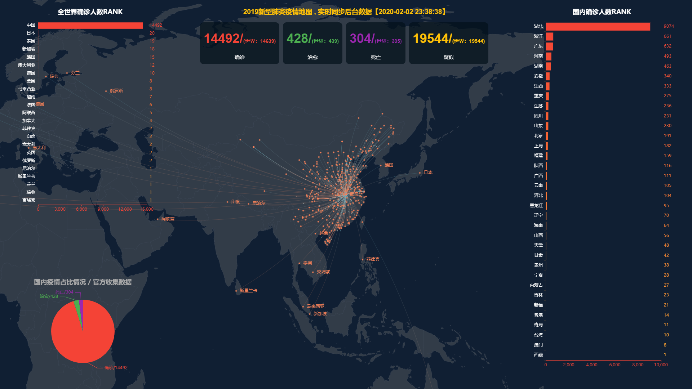

# ncov
Focus on Wuhan 2019-nCoV, data visualization, to help analyze the epidemic situation.  May the world be well. 关注新型肺炎，数据可视化，以提供帮助分析疫情。 愿世界安好。

> 声明：本库旨在分析有关nCvo官方提供的地点、人数、等医学数据进行分析可视化数据。同时个人也希望能够相关工作提供一丢丢儿分析帮助，如果觉得该仓库帮倒忙，请联系作者删除仓库。并为未来可能引发不好的事件致歉。by @veaba 2020年1月20日10:42:30

 <a href="http://2020-ncov.datav.ai">2020-nCov感染可视化，不再维护</a> |   
 <strong>
  <a href="http://2019-ncov.datav.ai">2019-nCov弹幕支持，新版可视化(全实时通信)</a>
 </strong>

## 技术栈架构

原本是想做一个疫情行为分析的项目，一边学习TensorFlow去分析的，但现在看起来，实用性不大，太小学生了。

昨天认真想了一夜，这个项目对于疫情实在没什么帮助，于是重新定位这个仓库用途：一个关于疫情可视化分析全栈式学习项目。

不管你在IT领域从事何种工作，不管是在读学生还是对开源web技术有兴趣的人群，都可以从这个项目中或多或少有一些小帮助。

代码可能有些粗劣，但这是一个web全栈技术的体现，涉及到实时通信，前后端分离，可视化大屏，容器化，消息队列，OAuth、python、kafka、爬虫等。

性能上不会考虑太多问题，只是根据业务角度来做选型实现，所有方案都非常的初级，甚至可能被抛弃。

里面的技术方案基本都是平常积累的应用，如果有匹配度高的场景，好好改造下代码，应该也可以适用于小规模的业务使用。

鉴于此，我下面详细描述下这个仓库技术方案。

### 前端: client目录

#### vue3

本仓库前端使用Vue-next(即Vue3), 提前走进vue 3的 实战项目
- 注意：不要刷新页面，本页面与后端交互是通过socket.io，刷新页面即认为重新登录，需要重新走授权流程
- [vue-next](https://github.com/vuejs/vue-next)， 尚未正式发布还是alpha阶段vue
- vue3提供了一些新写法，但由于麻烦还是换回了vue2的方法
- 前端项目是改造 [vue-next-webpack-preview](https://github.com/vuejs/vue-next-webpack-preview)
- alpha3->alpha4时候，源码改造了一个非常基础实例化入参方式（详见/client/main.js），于是页面挂了。
    - 在正式上线时候，一定一定要写死package的版本引用。如果不清楚的话，这排查起来非常费劲。[反面教材](https://github.com/vuejs/vue-next/issues/664)
    - 比如 href 不能在 '&'字符，见[vuejs/vue-next "&" is not allowed in attribute values](https://github.com/vuejs/vue-next/issues/663)，现已修复，可能要等到下个版本
    
- 手动实现`vue`数字滚动，[示例](https://2019-ncov.datav.ai/)
    - 得益于vue中能够watch对象变化，所以就很好实现。当新数字过来的时候，需要滚动
    - 由于vue 3的未成熟，导致了很多插件、特效都需要自己手动模拟出来，当然也是一个学习的过程
    - 这里的关键点的是，首次要先全部出来，后面的数字watch然后定时++到新的对象上去

- 手动实现`vue`弹幕效果
    - 参考了现有弹幕网站的效果实现。
    - 不足：颜色变化、高度等
    - [KagurazakaHanabi](https://github.com/veaba/ncov/issues/6#issuecomment-583697395) 说有弹幕库，有兴趣可以调用它玩玩。[弹幕库:CommentCoreLibrary](https://github.com/jabbany/CommentCoreLibrary)

#### ECharts
- [ECharts官网](https://www.echartsjs.com/zh/index.html)， 国内比较主流的可视化库
- 不足：可以定制化图表类型，现在的全量加载
    
####  webpack
- [webpack官网](https://www.webpackjs.com/)
- 自己学吧，无能为力，不懂就搜

####  socket.io
- `websocket` 领域比较完善的库
- 说起来很巧，半年以前自己翻译了一波[socket.io的中文文档](https://github.com/veaba/socket.io-docs)
- [官网](https://socket.io/)
- 技术要点
    - room如何使用
    - 如何指定人发送消息
    - 如何emit发送消息
    - 如何on接收消息
- 不足：
    - 不知为何，有时候前端emit后，到达后端的过程会很慢，甚至不可达
    - 带宽很费劲
- 思考：如何考虑一连接进来就推送历史的弹幕？
- websocket是要附加在HTTP服务上的，大多数情况下，和前端的web服务是要独立开来，所以问题是：
    - [nginx 配置转发socket.io](https://socket.io/docs/using-multiple-nodes/#NginX-configuration)
    - 记录实时在线人数：在[这个页面](https://2019-ncov.datav.ai/) 有个在线人数统计功能，这个是实时的，连接、退出都会被记录
- socket.io 通用事件的调用

### 后端：servers目录

#### python 爬虫
- 基于selenium 实现爬虫抓取
- linux上和windows差异性需要注意下
- 不足：现在这个项目，自己改了个镜像但跑的不好，暂停了
- 从前端视角去看python的执行机制就感觉被秀逗了，非常难受
- 之前是想用python 做web服务了。个人能力有限，跑不动，到底还是node比较舒服
- 可以搭配kafka
- 也可以搭配mongo做一些录入，但注意，数据格式的转化挺头疼的事情
- todo TensorFlow
    
#### mongodb 数据库
- 对于前端来说node+mongodb简直神器组合
- node 端使用mongoose类库，和mongodb使用
- 舒服的格式转换个js天生支持json和mongodb支持js对象就很让人安心
- 不足：当然查询量1w以上时候，需要注意性能问题了，10s才完成
    - 没优化好，当然可能是查询的语句不够好
- 主要安全问题
    - 如授权，需要设置密码
    - 端口的暴露也需要看一下限制白名单
#### redis 
- [redis官网](https://redis.io/)
- [node-redis](http://redis.js.org/)
- 主要用来存储一些即时的数据，如token，在线状态
- 注意对要内存要求高
    
#### kafka 消息队列
- [kafka官网](http://kafka.apache.org/)
- kafka给我的体验不太好
- 我要在这里实名举报这几个类库：
    - [kafka-node](https://github.com/SOHU-Co/kafka-node)
        - 文档写的什么玩意？？？
        - 使用起来各种问题，API设计成什么样？
        - 据说sohu的库
        - 实在是被搞的炸毛，吐槽一波，舒服
    - [node-kafka](https://www.npmjs.com/package/node-kafka)
        - 不予置评
    - [kafkajs](https://github.com/tulios/kafkajs)
        - 不搭个kafka集群还用不了，是不？
        - 这个项目在用
- kafka贼慢，导致发送代码过一会才出来
    - 用户发送弹幕，生产者写入
    - 取出来是从消费者读出来的
    - 不足：这两种的时间差导致有些慢
    
#### node 
主要给页面提供转接内容和socket通信
- 使用TypeScript书写
- pm2容器化运行

### 服务器
docker需要运行，建议4G以上，kafka是java的吧？据说java不都是4G起步？
- 建立docker网络，指定内网ip
- 设置白名单端口
- 放行策略
- 敏感组件关闭开发给公网

### OAuth 走的是Github的授权
- 仅注册使用，相关内容见 [OAuth](https://developer.github.com/v3/oauth/)
- 你也可以[取消授权](https://github.com/settings/installations)）

### 可持续继承、运维、容器化

- docker
    - [docker官网](https://www.docker.com/)
- docker-compose
    - web服务使用docker-compose编排
    - 此前个人用的 [learn-docker-compose](https://github.com/veaba/learn-docker-compose), 很多部分笔记没有放出来
- gh-pages. 为了灵活化配合nginx代理，已不用gh-pages了，但此前的配置可以参考 [配合Actions生成ph-pages](https://github.com/veaba/ncov/blob/master/.github/workflows/deploy.yml)
- Github Actions. 自己写部署的脚本 [build.sh](https://github.com/veaba/ncov/blob/master/scripts/deploy-client.sh)
- 拓展：k8s(Kubernetes)

### CDN

现在是调用CDN，但为了保险建议还是存一份本地库在服务器上，以免CDN炸机，

- 个人使用的小网站，可以走cloudflare，但要处理，第一次生效和取消，都有一段时间的空档期，升级时，避免高峰期访问
- 云服务器厂商的服务，收费，贵

### shell
- 灵活化自己的部署，需要写一些shell脚本 [build.sh](https://github.com/veaba/ncov/blob/master/scripts/deploy-client.sh)
- 从之前的项目迁移过来 [vuepress-actions](https://github.com/veaba/vuepress-actions)

### nginx
- 这个仓库没放出nginx.conf，但需要知道怎么配置
- 前后端分离项目，一般需要nginx做反向代理一些API等

### 内容：
- 通信全走实时通信socket.io 
- 全世界RANK
- 中国省份RANK
- 疫情饼图
- 统计数据有更新会自动滚动
- 地图数据全部是实时
- 内容更新1-3分钟不等
- 弹幕系统
- 数据：大屏API走的腾讯新闻的接口

### 教训、心得
- 上线部署的时候，真的非常小心了。由于本地配置和线上配置还是有些差异的
- 注意安全性问题
- 还是极致比较好些吧
- 权当一次技术学习

## 贡献/Contribute
[贡献/Contributor](https://github.com/veaba/ncov/graphs/contributors)

## 关于

### 为什么会有本站？

- 提供可视化分析，一次个人技术栈练习
- 基于Vue+ECharts 实现，具体见 [开发文档](dev.md)
- 同时本仓库暂不提供API，但可以直接对接socket.io 进行通信，目前并未设置权限

### 关于本人
目前职业是前端，主要从事vue项目的ctrl+c、ctrl+v

### 其他疫情项目
鉴于本仓库的局限性，可能适合个人用来学习练手的全栈式项目，我个人认为这个项目对实际帮助疫情的可能性不大，所以推荐下其他疫情的项目，免得大家迷路。

- [wuhan2020](https://github.com/wuhan2020/wuhan2020) 新型冠状病毒防疫信息收集平台，多人协作，可以派得上用场的项目
